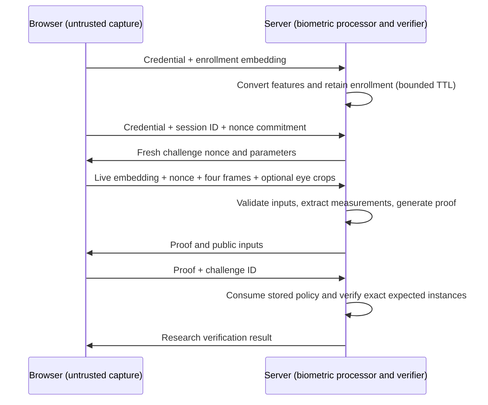

<div align="center">


# SABLE: Secure Attested Biometric Library for Edge

**Prove who you are without revealing your biometric data**

[](https://opensource.org/licenses/Apache-2.0)
[](https://www.rust-lang.org)
[](https://codeberg.org/anuna/sable)
[](https://codeberg.org/anuna/sable)
[](https://codeberg.org/anuna/sable)

</div>

---

## Disclaimer

The [2026-09-14 security assessment](docs/security/RED-TEAM-FINDINGS-2026-09-14.md)
found critical and high vulnerabilities. [Remediation is in progress](docs/security/REMEDIATION-2026-09-14.md).
The legacy Groth16 (`zk`) and mobile APIs and Android/iOS packages are withdrawn;
their build entry points deliberately fail. Existing certificates and trust-store
signatures made with the former placeholder signature algorithm are invalid and
must not be migrated as trusted records. Replacing that algorithm with Ed25519
does not establish X.509 or revocation validation.
The legacy attestation, chain and trust-store APIs are quarantined from library
builds while their standards-based replacement is implemented.
The demo server requires operator-provisioned credentials; see
[restricted demo access](docs/security/DEMO-ACCESS.md) before running it.

**This code has been generated by AI and is currently in active development. It is NOT suitable for production use at this stage.**

- The cryptographic implementations require extensive security auditing
- Mobile support is unavailable pending replacement and device testing
- Performance benchmarks require validation on target hardware
- The codebase is experimental and may contain bugs or vulnerabilities

**Do not use this library for any security-critical applications without proper auditing and validation.**

---

## Description

SABLE researches biometric matching with zero-knowledge proofs. The current browser
demo performs centralized biometric processing: embeddings, flash frames and eye
crops are sent to the server, which generates and verifies the proofs. Enrollment
records expire after 15 minutes and are evicted every five seconds. This is not
on-device private authentication.

The proof hides its private witness from someone inspecting the proof alone.
That does not hide inputs from the server that generated it, authenticate a
camera, or establish a person's identity. Deterministic fuzzy enrollment and
deduplication are withdrawn because public helper data enables offline guessing
and cross-matching.

The legacy unauthenticated P2P sessions and BLE/NFC wrappers are also withdrawn.
Their Noise XX replacement is internal test code, not an available attested
transport. See the [remediation record](docs/security/REMEDIATION-2026-09-14.md)
for the outstanding identity-binding and release gates.

### Current capabilities

The browser demo is centralized research software, not an identity service.
It exercises Halo2 biometric relations and verifier-owned policy checks. It does
not provide on-device-only privacy, physical-capture authentication, government
attestation, selective credential disclosure or an exported authenticated P2P channel.

The active Halo2 backend uses locally generated BN254 KZG parameters. It is not a
transparent setup, and production setup provenance has not been established.
Mobile, legacy Groth16 and attestation APIs are withdrawn. Registry publishing and
the deployment-image build are blocked by the security release hold; local
research builds remain available.

## Demo

The interactive demo showcases the full flow with real Halo2 zero-knowledge proofs and screen flash liveness detection.

### Running the demo

```bash
git clone https://codeberg.org/anuna/sable.git
cd sable

# Build the demo server (includes Halo2 ZK prover)
cd demo/server
cargo run --release

# Open http://localhost:3001 in your browser
```

The server serves both the API and frontend. No separate frontend build step needed.

> **Note:** Requires [Rust nightly](https://rustup.rs/) (enforced via `rust-toolchain.toml`). If Homebrew's `rustc` shadows rustup, use `rustup run nightly cargo run --release`.

### Demo flow

1. **Enroll** -- capture your face via webcam, thermometer-encode the embedding, and register both a Pedersen commitment and a Poseidon template commitment
2. **Authenticate** -- recapture your face, undergo screen flash liveness detection, then generate a Halo2 ZK proof that computes the biometric distance in-circuit and proves your live scan matches the enrolled template
3. **Verify** -- validate the proof, seeing exactly what was proven vs. what stayed private

The liveness check uses controlled-illumination reflectance analysis (based on Tang et al., NDSS 2018) to distinguish real 3D faces from photos displayed on screens.

## Installation

### Prerequisites

- [Rust nightly](https://rustup.rs/) (enforced via `rust-toolchain.toml`)
- [Node.js 18+](https://nodejs.org/) (only if rebuilding the web frontend)

### Building from source

```bash
git clone https://codeberg.org/anuna/sable.git
cd sable

# Build the core library
cargo build --release

# Build with Halo2 ZK features
cargo build --release --features halo2

# Run the test suite (557 tests, ~95 halo2-specific)
cargo test --features halo2 -p sable-core --lib --test integration
```

### As a library

```rust
use sable_core::zk::halo2::FaceVerificationProver;
use sable_core::crypto::pedersen::PedersenCommitment;
use sable_core::crypto::poseidon::PoseidonHash;
```

See the [demo server handlers](demo/server/src/handlers.rs) for a complete integration example.

## How it works

### Current demo data flow



The proof does not hide inputs from the server that generated it. The browser
does not attest that its inputs came from a live camera. See the
[capture boundary](docs/security/CAPTURE-TRUST-BOUNDARY.md).

### In-circuit matching and template binding

The research circuit implements two relations; this description is not an independent soundness assessment:

- **In-circuit distance** -- the Hamming distance between the live scan and the enrolled template is computed *inside* the circuit from the two 512-byte embeddings, rather than supplied as a trusted witness. Each per-byte XOR popcount is computed algebraically (`popcount(a) + popcount(b) − 2·⟨a_bits, b_bits⟩`), so a prover cannot simply assert an arbitrarily small distance to force a match.
- **Template binding** -- the enrolled template is bound to a Poseidon commitment exposed as a public input. Verification checks this against the commitment registered at enrollment, so a valid proof computed over a *different* template is rejected.

Embeddings are **thermometer-encoded** (L=9 ordinal levels at the same 8 bits/dimension as binary). Ordinal encoding recovers the accuracy that binary Hamming discards, and the circuit constrains every byte to be a valid thermometer code so the L1-distance equivalence cannot be subverted.

### Selective disclosure (planned)

BBS+ credentials and government identity integration are intended capabilities,
not part of the current proof or demo. No composite biometric/credential proof
or validated government attestation is available.

### Liveness detection

SABLE experiments with spatial flash challenge-response as presentation-attack risk reduction. Its effectiveness is not established by a valid proof or a successful demonstration. There is no cryptographic authentication of the camera or physical capture.

**Protocol:**

1. **Unpredictable challenge** -- Both client and server contribute random 32-byte nonces. The client commits to its nonce (SHA-256) before the server reveals its own. Their combined hash (HKDF-SHA256) determines the color pattern -- neither side can predict or replay it. The challenge expires after 30 seconds and can only be used once.

2. **Four-quadrant color flash** -- The screen flashes a *different color in each of four quadrants* across 3 rounds, with the grid boundary shifted per round by the HKDF output. Colors are derived deterministically with photosensitive safety clamping (WCAG 2.3.1) and a minimum angular distance between adjacent quadrants.

3. **Reflectance and geometry** -- The camera captures a baseline frame and one frame per round. The server checks that each quadrant's mean color delta points toward its quadrant color (cosine similarity) and that adjacent quadrants respond differently. On top of that, SPEC-006 adds three *geometric* cues extracted from the same frames: **coverage** (how many patches of a 4×4 face grid responded at all), **convexity** (how much the illumination mix varies across patches, which a flat reflector cannot produce), and a **corneal glint** fingerprint per eye compared field-wise against the round's expected composite color.

4. **ZK proof of liveness** -- Twelve quantized delta fingerprints, the per-round coverage counts, convexity scores and glint fingerprints enter the Halo2 circuit as private witnesses. Every public liveness parameter -- the expected colors, every threshold and floor, and SHA-256 of both coin-flip nonces -- is hashed with Poseidon into one **challenge digest** the verifier recomputes, so a proof answers exactly one challenge under exactly the parameters the verifier issued. The circuit outputs a single liveness bit. A proof-only recipient sees the public result and digest; the demo server also receives the images and extracts the reflectance data.

**Fingerprint encoding** (16-bit, identical in Rust and TypeScript):
```
[order:3 | mid_ratio:4 | min_ratio:4 | magnitude:5]
```
`order` is categorical and is compared by equality, never by bit distance. Expected fingerprints carry no magnitude; magnitude is judged only against a public floor on the observed side (SPEC-006 REQ-125).

**Status of the in-circuit relation (honest reading, September 2026):**
- Every threshold and floor ships **unset** (SPEC-006 ADR-010). A threshold of zero makes its check vacuous, visibly so in the digest. The operating constants come from a presentation-attack study (EXP-003) that has not yet run; the demo exposes them as environment variables labelled as demo settings.
- The 0.1.0 fingerprint colour check does not hold on a webcam: the reflected delta is a common-mode brightening of a few RGB units shared by every quadrant, so a fingerprint of its direction cannot agree with the quadrant colour at any threshold. A cosine bound on raw deltas, matching the server's own check, is specified as SPEC-006 REQ-126 for the next revision.
- In the first live runs on one device, **coverage** was the cue that separated a face (10-16 of 16 patches) from a phone-screen replay (4-6). The demo profile arms only that floor. Under direct sunlight a real face fell to 3-10, so coverage cannot tell "flat" from "barely lit"; a client-side illumination pre-check is a pilot requirement.
- The corneal glint at 640×480 has a magnitude of one or two units, which is noise. It needs brighter flash or a closer camera before it carries evidence.

Details: `docs/specs/SPEC-006-geometric-liveness.md`, `docs/specs/BUG-003-expected-fingerprint-magnitude-mismatch.md`, `docs/experiments/EXP-003-prepilot-notes.md`.

**Limitations:**
- Demonstrations on one subject/device do not establish resistance to photos, screen replays or fabricated witnesses
- Not a substitute for depth sensors or infrared
- Sophisticated 3D masks or real-time video manipulation are not addressed
- Needs the screen to be the dominant light change on the face: bright ambient light or direct sun defeats the capture, not the check

### Interpretation of a verification result

An accepted proof means that the circuit relation holds under the server's stored
template, threshold, liveness parameters and challenge policy. It does not mean a
trusted camera observed a person, establish government identity, or approve access
to a real service. SABLE does not assume a device or attestation provider. Capture
provenance and any associated trust policy belong to a separate application
integration; they are not implied by proof acceptance. Client-side proving remains
required work for the on-device privacy objective.

## Architecture

### Project structure

```
sable/
├── core/                    # Core cryptographic library (sable-core)
│   └── src/
│       ├── biometric/       # Face/palm feature extraction, liveness, screen flash
│       ├── crypto/          # Pedersen, Poseidon, RNG
│       ├── zk/halo2/        # Halo2 circuits (quantizer, thermometer, poseidon, hamming, threshold, liveness)
│       ├── mobile/          # Android/iOS FFI, keystore, sensors
│       ├── p2p/             # NFC, BLE, WiFi Direct, session management
│       └── attestation/     # X.509 certificates, chain validation, trust store
├── demo/
│   ├── server/              # Axum REST API with real Halo2 proofs + liveness
│   └── web/                 # TypeScript/Vite frontend (served by demo server)
├── docs/
│   ├── specs/               # Technical specifications
│   ├── plans/               # Implementation plans
│   └── security/            # Threat model and audit checklists
├── platform/                # Platform-specific integrations
├── bench/                   # Benchmarks
└── fuzz/                    # Fuzz tests
```

### Feature flags

| Flag | Description |
|------|-------------|
| `std` (default) | Standard library support |
| `halo2` | Research Halo2/KZG proof system; locally generated setup |
| `mobile` / `zk` | Withdrawn; compilation intentionally fails |
| `simd` / `neon` | ARM SIMD/NEON optimizations |

### Technical building blocks

| Component | Technology | Purpose |
|-----------|-----------|---------|
| Elliptic curve | BLS12-381 / BN254 | Pedersen commitments, 128-bit security |
| Hash | Poseidon | ZK-friendly hash for feature vectors (~10x faster than SHA-256 in circuits) |
| Commitments | Pedersen | Hiding commitment acts as "biometric public key" |
| ZK proofs | Halo2/KZG | In-circuit Hamming relation; local research setup, not production setup provenance |
| Biometric encoding | Thermometer (L=9) | Ordinal encoding at 8 bits/dim; recovers accuracy that binary Hamming discards, constrained valid in-circuit |
| Liveness | Spatial flash + geometric cues | Four-quadrant color challenge-response (after Tang et al., NDSS 2018) with coverage, convexity and corneal cues in circuit (SPEC-006); nonce-bound Poseidon challenge digest; thresholds pending EXP-003 |
| Biometrics | Face / Palm | 1024-dim embeddings, Gabor filters, multi-modal fusion |
| P2P | Withdrawn | Internal Noise XX replacement under test; no exported authenticated channel |
| Attestation | Withdrawn | Real certificate validation, revocation and credential integration remain |

### Performance (Halo2, release mode, Apple Silicon)

| Operation | Target | Achieved |
|-----------|--------|----------|
| Proof generation (in-circuit matcher + binding + liveness, k=16) | ≤ 1000ms | ~970ms |
| Verification | ≤ 50ms | ~1.8ms |
| Proof size | ≤ 10KB | 2.08KB |
| Spatial flash challenge | -- | 3 rounds, ~1s total |

## Security

**Not approved for security-critical authentication or public deployment.**
Read the [current threat model](docs/security/THREAT_MODEL.md) and
[remediation record](docs/security/REMEDIATION-2026-09-14.md). The earlier review's
production recommendation has been withdrawn.

The server sees biometric embeddings and images. Enrollment records have bounded
TTLs and zeroize stored buffers on drop, but active request copies, decoder buffers,
operator access, logs, dumps and transport termination remain exposure paths.
Commitments and zero-knowledge proofs do not remove those paths.

Verifier-owned policy checks and single-use challenges address policy substitution
and proof replay. They do not authenticate physical capture. Software-only liveness
is presentation-attack risk reduction with unvalidated thresholds, not a
cryptographic guarantee of presence. Independent constraint, privacy, side-channel
and biometric accuracy assessments remain necessary.

The active proof backend is KZG on BN254 with locally generated setup parameters.
Do not infer a transparent setup, a verified ceremony or a production security level
from the Halo2 name. Hardware keystore, government PKI and authenticated sensors are
not available security controls in this build.

## Project status

Active research and security remediation. Feature-complete and production-ready
claims are withdrawn. Test counts and exact scope are maintained in the
[remediation record](docs/security/REMEDIATION-2026-09-14.md), not treated as proof of
complete system security.

| Surface | Current status |
|---|---|
| Halo2 matching, template binding and policy verification | Research implementation with focused tests; full assessment incomplete |
| Browser/server demo | Centralized biometric processing; operator credentials required |
| Software liveness | Experimental; no authenticated physical provenance or validated PAD operating point |
| Client-only proving | Planned |
| Legacy Groth16 and mobile APIs | Withdrawn; builds fail intentionally |
| Government attestation and revocation | Legacy API withdrawn; replacement incomplete |
| P2P transport | Legacy API withdrawn; private Noise replacement under test |
| Deterministic fuzzy authentication/deduplication | Withdrawn |
| Registry publishing and deployment image | Blocked by security release hold |

### Release hold

`sh ci/security-release-gate.sh` deliberately exits unsuccessfully while critical
and high remediation is incomplete. Both Rust packages set `publish = false`;
`demo/Dockerfile` invokes the gate before building a distributable image. Local
`cargo build` and tests are unaffected. Existing remote deployments and binaries
have not been revoked or changed.

Lifting the hold requires reviewed requirement-by-requirement evidence for the
red-team findings, not an environment-variable override or a changed status table.

### Intended future uses

Identity, access control and selective-disclosure use cases require completed
capture trust, client privacy, attestation, transport and platform work plus an
independent assessment. They are not supported deployment recommendations.

## Contributing

Contributions are welcome. Please open an issue to discuss proposed changes before submitting a pull request.

## Authors

Hugo O'Connor, [Anuna Research](https://anuna.io)

## License

[Apache 2.0](LICENCE)
