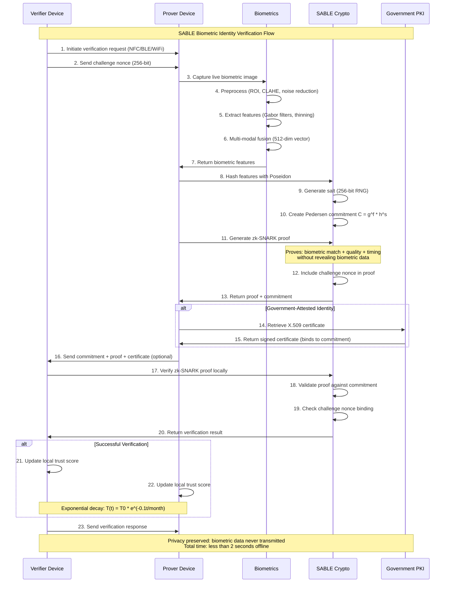

<div align="center">


# SABLE: Secure Attested Biometric Library for Edge

**Prove who you are without revealing your biometric data**

[](https://opensource.org/licenses/Apache-2.0)
[](https://www.rust-lang.org)
[](https://codeberg.org/anuna/sable)

</div>

---

## Disclaimer

**This code has been generated by AI and is currently in active development. It is NOT suitable for production use at this stage.**

- The cryptographic implementations require extensive security auditing
- The mobile integrations need thorough testing on real devices
- Performance benchmarks require validation on target hardware
- The codebase is experimental and may contain bugs or vulnerabilities

**Do not use this library for any security-critical applications without proper auditing and validation.**

---

## Description

SABLE lets you verify your identity between smartphones using biometrics (like palm prints or face scans) **without exposing your actual biometric data** to anyone -- not to the person verifying you, not to the government, and not to any central database.

It does this by creating a mathematical proof of your biometric data that confirms it's you without revealing what that data actually is. Think of it like a tamper-proof envelope that says "this person is verified" without anyone being able to see what's inside.

### The problem

- **Traditional systems** store your fingerprints/face scans in databases that can be hacked, misused, or accessed by governments
- **Blockchain solutions** require internet, cost money for each verification, and often still expose data
- **Current mobile auth** only works on your own device, can't prove identity to others

### How SABLE is different

- **Complete privacy** -- your biometric data never leaves your phone
- **Works offline** -- no internet, servers, or blockchain needed
- **Government verification** -- officials can certify you without accessing your biometrics
- **Mobile-first** -- designed specifically for smartphones, fast and efficient
- **Dual ZK backends** -- Groth16 (Arkworks) and Halo2 (transparent setup) proof systems

## Installation

### Prerequisites

- [Rust nightly](https://rustup.rs/) (enforced via `rust-toolchain.toml`)
- [Node.js 18+](https://nodejs.org/) (for the web demo frontend)

### Building from source

```bash
git clone https://codeberg.org/anuna/sable.git
cd sable

# Build the core library
cargo build --release

# Build with Halo2 ZK features
cargo build --release --features halo2

# Run the test suite (484 tests, 77 halo2-specific)
cargo test --features halo2 -p sable-core --lib --test integration
```

> **Note:** If Homebrew's `rustc` shadows rustup, use `rustup run nightly cargo ...` explicitly.

## Usage

### Running the demo

The demo server showcases the full enrollment, proof generation, and verification flow with real Halo2 zero-knowledge proofs.

```bash
# Start the backend (serves on http://localhost:3000)
cd demo/server
cargo run --release --features halo2-proofs

# In a new terminal, start the frontend (serves on http://localhost:5173)
cd demo/web
npm install
npm run dev
```

Open `http://localhost:5173` in your browser. The demo walks through:

1. **Enroll** -- capture biometrics and create a cryptographic commitment
2. **Authenticate** -- generate a zero-knowledge proof matching enrolled biometrics
3. **Verify** -- validate the proof, seeing what was proven vs. what stayed private

### As a library

```rust
// Feature flags: "zk" for Groth16, "halo2" for Halo2 proofs
// See core/src/lib.rs for the full API surface
use sable_core::crypto::poseidon::PoseidonHash;
use sable_core::crypto::pedersen::PedersenCommitment;
```

See the [demo server source](demo/server/src/handlers.rs) for a complete integration example using the Halo2 proof system.

## How it works

1. **Capture** -- use your phone's camera to scan your palm or face
2. **Secure** -- your phone creates a mathematical proof of your identity that can't be reversed or faked
3. **Share** -- when someone needs to verify you, your phones talk directly via NFC/Bluetooth (no internet needed)
4. **Verify** -- they get confirmation you're legitimate without seeing your actual biometric data
5. **Attest** -- government agencies can officially verify you without storing your biometrics

### Verification flow



### Remote verification

While SABLE's core design focuses on peer-to-peer verification, the same architecture extends to remote scenarios:

- **Commitment as "biometric public key"** -- the Pedersen commitment `C = g^f * h^s` acts like a public identifier
- **Global distribution** -- commitments can be stored in databases, blockchains, or directory services
- **Remote proof generation** -- the person generates a ZK proof on their device
- **Remote verification** -- online services verify the proof against the stored commitment

Use cases include website login, digital government services, enterprise VPN access, and telehealth patient verification. The same privacy guarantees apply: only mathematical proofs travel over the network, never biometric data.

## Architecture

### Project structure

```
sable/
├── core/                    # Core cryptographic library (sable-core)
│   └── src/
│       ├── biometric/       # Palm/face feature extraction, liveness, fusion
│       ├── crypto/          # BLS12-381, Pedersen, Poseidon, Groth16, RNG
│       ├── zk/halo2/        # Halo2 circuits (quantizer, poseidon, hamming, threshold)
│       ├── mobile/          # Android/iOS FFI, keystore, sensors
│       ├── p2p/             # NFC, BLE, WiFi Direct, session management
│       └── attestation/     # X.509 certificates, chain validation, trust store
├── demo/
│   ├── server/              # Axum REST API with real Halo2 proofs
│   └── web/                 # TypeScript/Vite frontend
├── docs/
│   ├── specs/               # Technical specifications
│   ├── plans/               # Implementation plans
│   └── security/            # Threat model and audit checklists
├── platform/                # Platform-specific integrations
├── bench/                   # Benchmarks
└── fuzz/                    # Fuzz tests
```

### Feature flags

| Flag | Description |
|------|-------------|
| `std` (default) | Standard library support |
| `zk` | Groth16 zk-SNARK circuits via Arkworks |
| `halo2` | Halo2 transparent-setup ZK proof system |
| `mobile` | Mobile platform bindings and optimizations |
| `simd` / `neon` | ARM SIMD/NEON optimizations |

### Technical building blocks

- **BLS12-381 elliptic curve** -- Pedersen commitments with 128-bit security
- **Poseidon hash** -- ZK-friendly hash for feature vectors, ~10x faster than SHA-256 in circuits
- **Groth16 zk-SNARKs** -- via Arkworks, 199,273 R1CS constraints
- **Halo2 proofs** -- transparent setup (no trusted ceremony), KZG/SHPLONK polynomial commitments
- **Palm biometrics** -- 6x3 Gabor filter banks, Zhang-Suen thinning, multi-modal vein+print fusion
- **Screen flash liveness** -- RGB controlled-illumination reflectance ratio analysis (Tang et al., NDSS 2018)
- **P2P protocols** -- NFC/BLE/WiFi Direct with X25519 ECDH + ChaCha20-Poly1305 AEAD
- **Government PKI** -- X.509 certificate attestation levels (L1-L5) preserving citizen privacy

### Performance

| Operation | Groth16 (Arkworks) | Halo2 |
|-----------|-------------------|-------|
| Proof generation | ~850ms | ~450ms |
| Verification | ~12ms | ~2.2ms |
| Proof size | 192 bytes | 2.08 KB |
| Memory usage | 128 MB | -- |

Measured in release mode on Apple Silicon. All metrics meet non-functional requirements.

## Security

### Cryptographic assumptions

- **Discrete Logarithm Problem** -- hardness over BLS12-381 (128-bit security level)
- **Pairing-friendly curve security** -- BLS12-381 with embedding degree 12 resists known attacks
- **Poseidon hash** -- collision resistance in finite fields
- **Groth16 soundness** -- computationally sound under discrete log assumption
- **Halo2 soundness** -- transparent setup eliminates trusted ceremony risk

### What SABLE protects against

- **Biometric database breaches** -- no centralized biometric storage exists to breach
- **Government surveillance** -- officials cannot access citizen biometric data during attestation
- **Replay attacks** -- 30-second temporal constraints and 256-bit challenge nonces prevent reuse
- **Man-in-the-middle** -- ECDH session keys and nonce binding protect against interception
- **Biometric template extraction** -- Pedersen commitments cryptographically hide enrolled data
- **Network analysis** -- offline P2P operation eliminates network metadata

### Replay attack protection

- **30-second proof lifetime** enforced by zk-SNARK circuit timestamp constraints
- **Fresh biometric capture** required for each proof (no static replay)
- **Challenge-response protocol** with 256-bit nonces bound to specific sessions
- **Ephemeral session keys** via ECDH for P2P communication channels

### Assumptions and limitations

**Biometric attack vectors:**
- 0.25 Euclidean distance threshold yields ~1-2% false acceptance rate
- Presentation attacks (silicone palms, infrared prints) remain a risk without enhanced PAD
- Single modality exploitation possible when OR-rule fusion is used

**System dependencies:**
- Relies on Secure Enclave / Android Keystore integrity
- Assumes users maintain physical control of their devices
- Government PKI attestation requires trust in issuing certificate authorities

**Cryptographic limitations:**
- BLS12-381 is vulnerable to quantum computers (post-quantum migration needed by 2030-2035)
- Groth16 requires a trusted setup ceremony; Halo2 avoids this
- Circuit constraints must correctly encode verification logic

### Security recommendations for production

- Tighten distance thresholds to 0.17-0.20 (reduces FAR to <0.1%)
- Use AND-rule fusion (both modalities must pass)
- Add CNN-based presentation attack detection
- Require multi-spectral capture for anti-spoofing
- Integrate hardware security modules for key management
- Conduct formal verification of circuit constraints

### Security analysis by attack vector

| Attack Vector | Risk Level | Notes |
|---------------|-----------|-------|
| Cryptographic (forging proofs) | 128-bit security | Computationally infeasible |
| Biometric spoofing | ~1-2% success rate | Requires physical proximity and sophisticated materials |
| Device compromise | Variable | Depends on device root/jailbreak status |
| Template injection | High if device compromised | Requires privileged access |

For most real-world scenarios, biometric presentation attacks represent the primary threat vector. However, these are **targeted attacks requiring physical proximity**, not scalable remote attacks. The system prevents the more dangerous mass surveillance and database breach scenarios.

## Project status

**Active development.** The core library is feature-complete across all milestones but has not been audited for production use.

**484 tests passing | 199,273 R1CS constraints | 77 Halo2-specific tests**

| Milestone | Status |
|-----------|--------|
| Core cryptography (BLS12-381, Poseidon, Pedersen, RNG) | Complete |
| Zero-knowledge proofs (Groth16 circuits, Arkworks) | Complete |
| Mobile integration (Android JNI, iOS Swift, FFI) | Complete |
| Palm biometrics (vein + print extraction, fusion) | Complete |
| P2P protocol (NFC, BLE, WiFi Direct, sessions) | Complete |
| Government attestation (X.509, OID extensions, chain validation) | Complete |
| Production hardening (constant-time ops, SIMD, energy profiling) | Complete |
| Halo2 ZK face verification (transparent setup, demo server) | Complete |
| Screen flash liveness detection (reflectance ratio analysis) | Complete |

### Roadmap

- Post-quantum migration (quantum-resistant curves and hash functions)
- Hardware security module integration
- Formal verification of circuit correctness
- Advanced multi-spectral liveness detection
- Real-device testing and performance validation

## Use cases

- **Building access** -- tap your phone to enter secure facilities using biometrics, without cards that can be lost or copied
- **Age verification** -- prove you're over 18 without showing your ID or birth date
- **Government services** -- access benefits with officially attested credentials while keeping biometrics private
- **Peer-to-peer trust** -- verify someone's identity without needing internet or a central authority
- **High-security access** -- multi-modal authentication (vein + print) for critical systems
- **Online services** -- website login with biometric proof instead of passwords
- **Healthcare** -- telehealth patient verification and prescription authorization

## Contributing

Contributions are welcome. Please open an issue to discuss proposed changes before submitting a pull request.

## Authors

Hugo O'Connor, [Anuna Research](https://anuna.io)

## License

[Apache 2.0](LICENCE)
