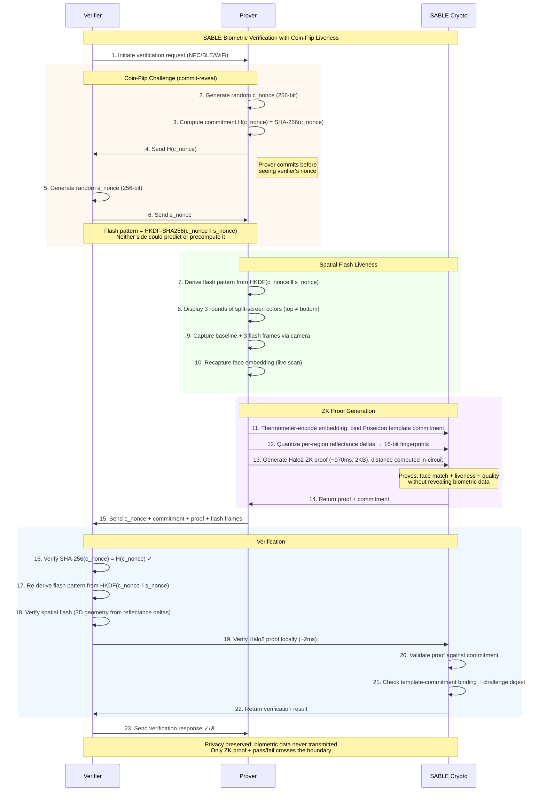

<div align="center">


# SABLE: Secure Attested Biometric Library for Edge

**Prove who you are without revealing your biometric data**

[](https://opensource.org/licenses/Apache-2.0)
[](https://www.rust-lang.org)
[](https://codeberg.org/anuna/sable)
[](https://codeberg.org/anuna/sable)
[](https://codeberg.org/anuna/sable)

</div>

---

## Disclaimer

**This code has been generated by AI and is currently in active development. It is NOT suitable for production use at this stage.**

- The cryptographic implementations require extensive security auditing
- The mobile integrations need thorough testing on real devices
- Performance benchmarks require validation on target hardware
- The codebase is experimental and may contain bugs or vulnerabilities

**Do not use this library for any security-critical applications without proper auditing and validation.**

---

## Description

SABLE lets you verify your identity using biometrics (like face scans) **without exposing your actual biometric data** to anyone -- not to the person verifying you, not to the government, and not to any central database.

It creates a zero-knowledge proof that your biometric data matches an enrolled template — without revealing the underlying data to anyone. Think of it like a tamper-proof envelope that says "this person is verified" without anyone being able to see what's inside.

### The problem

Existing approaches to biometric identity each compromise on something:

- **Centralized databases** store biometrics in servers that can be hacked, surveilled, or misused -- breaches expose millions of irrevocable biometric records
- **Cloud-based privacy solutions** use multi-party computation to split biometric templates across nodes, but still require always-on cloud infrastructure and trust in the operators
- **Blockchain-tied identity** requires internet, gas fees, and on-chain verification -- solving uniqueness but not privacy-preserving authentication
- **Hardware-dependent systems** need proprietary capture devices (e.g. iris scanners), limiting deployment to controlled environments
- **Standard mobile biometrics** only work on your own device and can't prove identity to a third party

None of these combine true zero-knowledge proofs over biometric data with offline operation, selective credential disclosure, and no special hardware.

### How SABLE is different

| Capability | Cloud MPC | Blockchain ID | Hardware-based | SABLE |
|-----------|-----------|---------------|----------------|-------|
| Biometric data stays on device | Sharded across cloud | Varies | On device | **On device** |
| True ZK proofs over biometrics | No (MPC matching) | Set membership | No | **Yes (Halo2)** |
| Works offline / peer-to-peer | No | No | No | **Yes** |
| No special hardware needed | Yes | No | No | **Yes** |
| Selective credential disclosure | No | No | No | **Yes (BBS+)** |
| No trusted setup / ceremony | N/A | Varies | N/A | **Yes** |
| Open source | No | Partial | No | **Apache 2.0** |

To our knowledge, SABLE is the first open-source system to combine all of these:

- **True zero-knowledge proofs** -- Halo2 proofs over biometric data (~970ms generation, ~2ms verification), with the biometric distance computed *inside* the circuit, not statistical matching on encrypted fragments
- **Fully offline** -- peer-to-peer verification via NFC/BLE with no cloud, blockchain, or internet dependency
- **Selective disclosure** -- optional government-issued Verifiable Credentials with BBS+ signatures let you prove predicates (e.g. "over 18") without revealing underlying data
- **No special hardware** -- works with any smartphone camera, using screen flash liveness detection to prevent spoofing
- **Transparent setup** -- Halo2 eliminates the trusted ceremony required by older ZK systems
- **Open source** -- Apache 2.0 licensed, fully auditable

## Demo

The interactive demo showcases the full flow with real Halo2 zero-knowledge proofs and screen flash liveness detection.

### Running the demo

```bash
git clone https://codeberg.org/anuna/sable.git
cd sable

# Build the demo server (includes Halo2 ZK prover)
cd demo/server
cargo run --release

# Open http://localhost:3001 in your browser
```

The server serves both the API and frontend. No separate frontend build step needed.

> **Note:** Requires [Rust nightly](https://rustup.rs/) (enforced via `rust-toolchain.toml`). If Homebrew's `rustc` shadows rustup, use `rustup run nightly cargo run --release`.

### Demo flow

1. **Enroll** -- capture your face via webcam, thermometer-encode the embedding, and register both a Pedersen commitment and a Poseidon template commitment
2. **Authenticate** -- recapture your face, undergo screen flash liveness detection, then generate a Halo2 ZK proof that computes the biometric distance in-circuit and proves your live scan matches the enrolled template
3. **Verify** -- validate the proof, seeing exactly what was proven vs. what stayed private

The liveness check uses controlled-illumination reflectance analysis (based on Tang et al., NDSS 2018) to distinguish real 3D faces from photos displayed on screens.

## Installation

### Prerequisites

- [Rust nightly](https://rustup.rs/) (enforced via `rust-toolchain.toml`)
- [Node.js 18+](https://nodejs.org/) (only if rebuilding the web frontend)

### Building from source

```bash
git clone https://codeberg.org/anuna/sable.git
cd sable

# Build the core library
cargo build --release

# Build with Halo2 ZK features
cargo build --release --features halo2

# Run the test suite (557 tests, ~95 halo2-specific)
cargo test --features halo2 -p sable-core --lib --test integration
```

### As a library

```rust
use sable_core::zk::halo2::FaceVerificationProver;
use sable_core::crypto::pedersen::PedersenCommitment;
use sable_core::crypto::poseidon::PoseidonHash;
```

See the [demo server handlers](demo/server/src/handlers.rs) for a complete integration example.

## How it works

### Architecture

```
         ┌───────────────────┐
         │    Government     │  optional
         │  (Identity Issuer)│
         └────────┬──────────┘
                  │ Verifiable Credential (BBS+)
                  ▼
┌──────────┐    ┌──────────┐    ┌──────────┐
│ You      │───▶│ZK Engine │───▶│ Verifier │
│ (User)   │    │          │    │          │
└──────────┘    └──────────┘    └──────────┘
 Camera          Poseidon hash   Proof check
 Liveness        Pedersen commit Pass / Fail
 Holds VC        Halo2 proof     Sees only
 + biometrics    Composite proof disclosed attrs
```

Biometric data never leaves the user's device. Only mathematical proofs and selectively disclosed credential attributes cross the boundary.

### Protocol flow

| Phase | You (Prover) | | Verifier |
|-------|-----------|---|----------|
| **Issue** *(optional)* | Receive Verifiable Credential from government | ← | -- |
| **Enroll** | Capture face, extract embedding, thermometer-encode | → | Register Poseidon template commitment + Pedersen commitment |
| **Challenge** | Generate c_nonce, send H(c_nonce) | → | Generate s_nonce, send back |
| **Liveness** | Derive flash pattern from HKDF(c_nonce ‖ s_nonce), display 3 split-screen rounds, capture frames | | |
| **Prove** | Generate Halo2 ZK proof (~970ms, 2KB) computing in-circuit distance + liveness fingerprints, bound to the template commitment | → | Verify H(c_nonce), re-derive pattern, check spatial flash |
| **Present** *(optional)* | Select attributes to disclose (e.g. "≥ 18") | → | Receive only chosen predicates |
| **Verify** | Receive pass/fail result | ← | Verify composite proof (~2ms) |

### In-circuit matching and template binding

The biometric match is proven soundly, not asserted. Two properties are enforced by the Halo2 circuit itself:

- **In-circuit distance** -- the Hamming distance between the live scan and the enrolled template is computed *inside* the circuit from the two 512-byte embeddings, rather than supplied as a trusted witness. Each per-byte XOR popcount is computed algebraically (`popcount(a) + popcount(b) − 2·⟨a_bits, b_bits⟩`), so a prover cannot simply assert an arbitrarily small distance to force a match.
- **Template binding** -- the enrolled template is bound to a Poseidon commitment exposed as a public input. Verification checks this against the commitment registered at enrollment, so a valid proof computed over a *different* template is rejected.

Embeddings are **thermometer-encoded** (L=9 ordinal levels at the same 8 bits/dimension as binary). Ordinal encoding recovers the accuracy that binary Hamming discards, and the circuit constrains every byte to be a valid thermometer code so the L1-distance equivalence cannot be subverted.

### Selective disclosure

With an optional government-issued Verifiable Credential (signed with BBS+ signatures), the user controls exactly what the verifier learns:

| Credential Field | Disclosed? | What verifier sees |
|-----------------|------------|-------------------|
| Full Name | Hidden | ████████ |
| Date of Birth | Hidden | ████████ |
| Age Check | Predicate | ≥ 18 |
| Nationality | Predicate | Valid |
| ID Number | Hidden | ████████ |
| Biometric Match | ZK Proof | Match ✓ |

The Halo2 proof simultaneously covers biometric match *and* credential predicates in a single composite proof. The Pedersen commitment acts as the binding anchor between the biometric data and the credential.

### Liveness detection

SABLE uses a spatial flash challenge-response protocol to make it significantly harder to spoof authentication with a photo, video, or screen replay. It is not foolproof -- sophisticated 3D masks or real-time video manipulation may still defeat it -- but it raises the bar well beyond static presentation attacks.

**Protocol:**

1. **Unpredictable challenge** -- Both client and server contribute random 32-byte nonces. The client commits to its nonce (SHA-256) before the server reveals its own. Their combined hash (HKDF-SHA256) determines the color pattern -- neither side can predict or replay it. The challenge expires after 30 seconds and can only be used once.

2. **Split-screen color flash** -- The screen flashes a *different color on top vs. bottom* across 3 rounds. The colors are derived deterministically from the HKDF output, with photosensitive safety clamping (WCAG 2.3.1) and minimum angular distance enforcement between paired colors.

3. **3D geometry detection** -- The camera captures how light reflects off the face in each round. The server checks that the upper and lower face regions respond *differently* to the different colors (cosine similarity between delta vectors must be below a threshold). A real 3D face reflects split-screen colors differently in forehead vs. chin regions due to geometry; a flat photo or screen reflects them identically.

4. **ZK proof of liveness** -- The per-region color responses are quantized into 16-bit delta fingerprints (encoding channel ordering, ratios, and magnitude). These fingerprints are fed into the Halo2 circuit alongside the face-match check, producing a single composite proof. The verifier learns only pass/fail -- no raw reflectance data is exposed.

**Fingerprint encoding** (16-bit, identical in Rust and TypeScript):
```
[order:3 | mid_ratio:4 | min_ratio:4 | magnitude:5]
```

**Limitations:**
- Defeats static photos and simple screen replays
- Not a substitute for depth sensors or infrared
- Sophisticated 3D masks or real-time video manipulation are not addressed
- Calibrated for typical webcam distances (~40-80cm); extreme distances may affect accuracy

### Verification flow



### Remote verification

While SABLE's core design focuses on peer-to-peer verification, the same architecture extends to remote scenarios:

- **Commitment as "biometric public key"** -- the Pedersen commitment `C = g^f * h^s` acts like a public identifier
- **Remote proof generation** -- the person generates a ZK proof on their device
- **Remote verification** -- online services verify the proof against the stored commitment
- **Selective disclosure** -- present only required credential attributes to the service

Use cases include website login, digital government services, enterprise VPN access, and telehealth patient verification. The same privacy guarantees apply: only mathematical proofs travel over the network, never biometric data.

## Architecture

### Project structure

```
sable/
├── core/                    # Core cryptographic library (sable-core)
│   └── src/
│       ├── biometric/       # Face/palm feature extraction, liveness, screen flash
│       ├── crypto/          # Pedersen, Poseidon, RNG
│       ├── zk/halo2/        # Halo2 circuits (quantizer, thermometer, poseidon, hamming, threshold, liveness)
│       ├── mobile/          # Android/iOS FFI, keystore, sensors
│       ├── p2p/             # NFC, BLE, WiFi Direct, session management
│       └── attestation/     # X.509 certificates, chain validation, trust store
├── demo/
│   ├── server/              # Axum REST API with real Halo2 proofs + liveness
│   └── web/                 # TypeScript/Vite frontend (served by demo server)
├── docs/
│   ├── specs/               # Technical specifications
│   ├── plans/               # Implementation plans
│   └── security/            # Threat model and audit checklists
├── platform/                # Platform-specific integrations
├── bench/                   # Benchmarks
└── fuzz/                    # Fuzz tests
```

### Feature flags

| Flag | Description |
|------|-------------|
| `std` (default) | Standard library support |
| `halo2` | Halo2 transparent-setup ZK proof system |
| `mobile` | Mobile platform bindings and optimizations |
| `simd` / `neon` | ARM SIMD/NEON optimizations |

### Technical building blocks

| Component | Technology | Purpose |
|-----------|-----------|---------|
| Elliptic curve | BLS12-381 / BN254 | Pedersen commitments, 128-bit security |
| Hash | Poseidon | ZK-friendly hash for feature vectors (~10x faster than SHA-256 in circuits) |
| Commitments | Pedersen | Hiding commitment acts as "biometric public key" |
| ZK proofs | Halo2 | Transparent setup, in-circuit Hamming distance (k=16), ~970ms proof gen, ~2ms verification, 2KB proofs |
| Biometric encoding | Thermometer (L=9) | Ordinal encoding at 8 bits/dim; recovers accuracy that binary Hamming discards, constrained valid in-circuit |
| Liveness | Spatial flash | Split-screen color challenge-response with 3D geometry detection (Tang et al., NDSS 2018) |
| Biometrics | Face / Palm | 1024-dim embeddings, Gabor filters, multi-modal fusion |
| P2P | NFC/BLE/WiFi Direct | X25519 ECDH + ChaCha20-Poly1305 AEAD |
| Attestation | X.509 / Verifiable Credentials | Government identity binding with selective disclosure |

### Performance (Halo2, release mode, Apple Silicon)

| Operation | Target | Achieved |
|-----------|--------|----------|
| Proof generation (in-circuit matcher + binding + liveness, k=16) | ≤ 1000ms | ~970ms |
| Verification | ≤ 50ms | ~1.8ms |
| Proof size | ≤ 10KB | 2.08KB |
| Spatial flash challenge | -- | 3 rounds, ~1s total |

## Security

### Cryptographic assumptions

- **Discrete Logarithm Problem** -- hardness over BLS12-381 (128-bit security level)
- **Pairing-friendly curve security** -- BLS12-381 with embedding degree 12 resists known attacks
- **Poseidon hash** -- collision resistance in finite fields
- **Halo2 soundness** -- transparent setup eliminates trusted ceremony risk
- **BBS+ signatures** -- selective disclosure without revealing hidden attributes

### What SABLE protects against

- **Biometric database breaches** -- no centralized biometric storage exists to breach
- **Government surveillance** -- officials cannot access citizen biometric data during attestation
- **Over-disclosure** -- selective disclosure reveals only requested predicates, not full credentials
- **Replay attacks** -- 30-second temporal constraints and 256-bit challenge nonces prevent reuse
- **Presentation attacks** -- spatial flash liveness makes it significantly harder to spoof with photos and screen replays (not foolproof against 3D masks)
- **Man-in-the-middle** -- ECDH session keys and nonce binding protect against interception
- **Biometric template extraction** -- Pedersen commitments cryptographically hide enrolled data

### Replay attack protection

- **30-second challenge TTL** -- each liveness challenge expires after 30 seconds and is single-use (consumed on first attempt)
- **Commit-reveal nonce protocol** -- client commits H(c_nonce) before server reveals s_nonce, preventing either side from manipulating the flash pattern
- **HKDF-derived color patterns** -- deterministic but unpredictable flash sequences from combined nonces
- **Fresh biometric capture** required for each proof (no static replay)
- **Spatial flash liveness** makes photo/video replay significantly harder by requiring 3D face geometry
- **Ephemeral session keys** via ECDH for P2P communication channels

### Assumptions and limitations

**Biometric attack vectors:**
- Presentation attacks (silicone faces, 3D prints) remain a risk without enhanced PAD
- Liveness detection is calibrated for screen-based attacks; sophisticated physical replicas may bypass it

**System dependencies:**
- Relies on Secure Enclave / Android Keystore integrity
- Assumes users maintain physical control of their devices
- Government PKI attestation requires trust in issuing certificate authorities

**Cryptographic limitations:**
- BLS12-381 is vulnerable to quantum computers (post-quantum migration needed by 2030-2035)
- Circuit constraints must correctly encode verification logic
- BBS+ selective disclosure requires compatible credential issuance infrastructure

### Security recommendations for production

- Add CNN-based presentation attack detection
- Require multi-spectral capture for anti-spoofing
- Integrate hardware security modules for key management
- Conduct formal verification of circuit constraints
- Implement credential revocation checking

## Project status

**Active development.** The core library is feature-complete across all milestones but has not been audited for production use.

**557 tests passing | ~95 Halo2-specific tests | Interactive demo with ZK liveness detection**

| Milestone | Status |
|-----------|--------|
| Core cryptography (BLS12-381, Poseidon, Pedersen, RNG) | Complete |
| Halo2 ZK face verification (transparent setup, demo server) | Complete |
| In-circuit Hamming matcher + Poseidon template-commitment binding | Complete |
| Thermometer (ordinal) biometric encoding | Complete |
| Spatial flash liveness with ZK proof (challenge-response, 3D geometry) | Complete |
| Interactive demo (enrollment, auth, liveness, verification) | Complete |
| Palm biometrics (vein + print extraction, fusion) | Complete |
| Mobile integration (Android JNI, iOS Swift, FFI) | Complete |
| P2P protocol (NFC, BLE, WiFi Direct, sessions) | Complete |
| Government attestation (X.509, chain validation) | Complete |

### Roadmap

- Verifiable Credentials with BBS+ selective disclosure
- Post-quantum migration (quantum-resistant curves and hash functions)
- Hardware security module integration
- Formal verification of circuit correctness
- Advanced multi-spectral liveness detection
- Real-device testing and performance validation

## Use cases

- **Age verification** -- prove you're over 18 without revealing your name, date of birth, or any other personal data
- **Government services** -- access benefits with officially attested credentials while keeping biometrics private
- **Building access** -- tap your phone to enter secure facilities using biometrics, without cards that can be lost or copied
- **Peer-to-peer trust** -- verify someone's identity without needing internet or a central authority
- **Online services** -- website login with biometric proof instead of passwords
- **Healthcare** -- telehealth patient verification and prescription authorization
- **Border control** -- prove nationality and identity without exposing full passport data

## Contributing

Contributions are welcome. Please open an issue to discuss proposed changes before submitting a pull request.

## Authors

Hugo O'Connor, [Anuna Research](https://anuna.io)

## License

[Apache 2.0](LICENCE)
